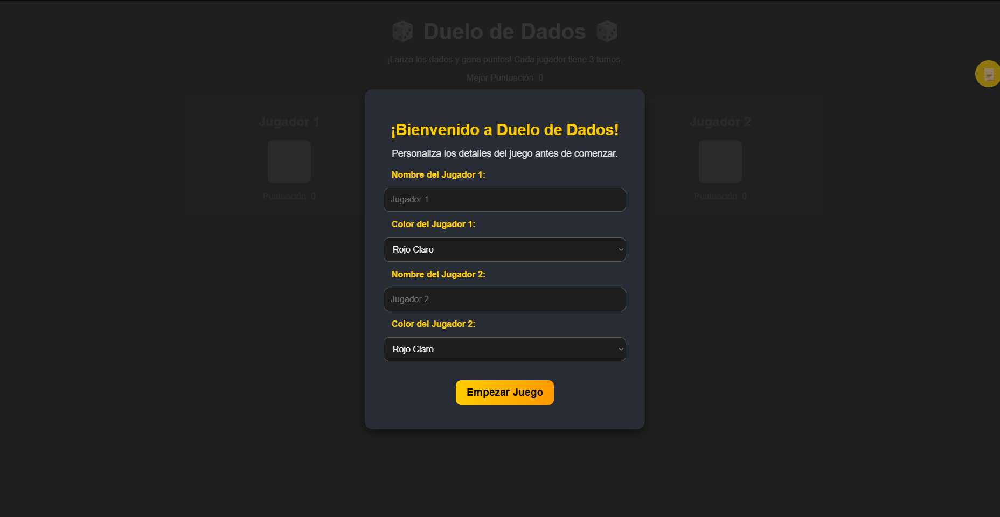
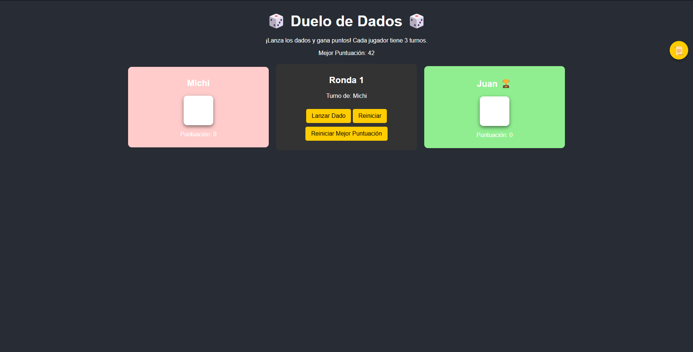
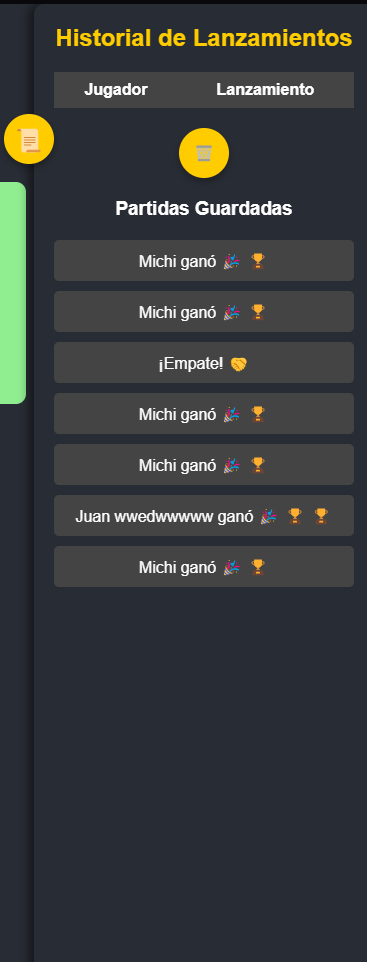
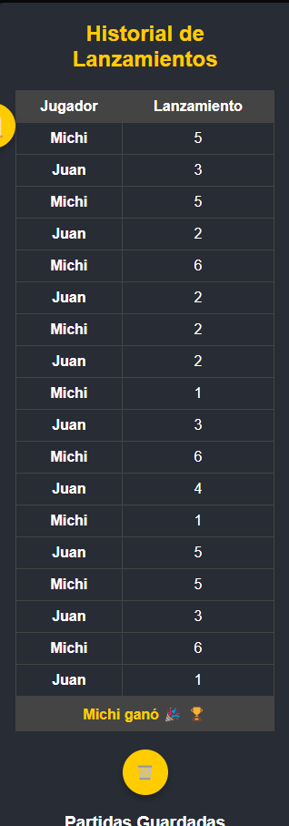

# 🎲 Duelo de Dados

## 📌 Descripción
**Duelo de Dados** es un juego interactivo basado en la web donde dos jugadores compiten lanzando un dado en tres rondas. El jugador con la mayor puntuación acumulada al final de la partida gana. Este proyecto utiliza tecnologías web modernas para ofrecer una experiencia dinámica y responsiva.

El juego incluye:
- **Interfaz interactiva** para dos jugadores.
- **Historial de lanzamientos** para registrar las puntuaciones.
- **Animaciones y efectos visuales** para mejorar la experiencia del usuario.

---

## 🕹️ Instrucciones para Jugar
1. Al cargar la página, se muestra una ventana emergente para personalizar los nombres y colores de los jugadores.
2. **Jugador 1** lanza el dado presionando el botón "Lanzar dado" o la barra espaciadora.
3. **Jugador 2** realiza su lanzamiento después.
4. Se repiten los turnos hasta completar **tres rondas**.
5. Al finalizar, se muestra el ganador o un mensaje de empate.
6. Puedes reiniciar el juego con el botón "Reiniciar".

---

## 📜 Reglas del Juego
- Cada jugador lanza el dado **una vez por turno**.
- El juego tiene un total de **tres rondas**.
- Gana el jugador con la **mayor puntuación acumulada**.
- Si hay empate, se mostrará un mensaje indicando el resultado.

---

## 📸 Capturas de Pantalla

### 1. **Pantalla de Inicio**
La pantalla inicial muestra una ventana emergente donde los jugadores pueden personalizar sus nombres y colores antes de comenzar el juego.



---

### 2. **Tablero de Juego**
El tablero principal muestra las secciones de cada jugador, el panel central con la ronda actual y el turno activo.



---

### 3. **Historial de Lanzamientos**
El historial dinámico registra los lanzamientos de cada jugador y muestra los resultados en una tabla.

<div align="center">
    
</div>

---

### 4. **Pantalla de Resultado**
Al finalizar las tres rondas, se muestra un mensaje indicando el ganador o si hubo un empate.

<div align="center">
    
</div>

---

## 🛠️ Tecnologías Utilizadas
Este proyecto fue desarrollado utilizando las siguientes tecnologías:
- **HTML5**: Para la estructura semántica de la interfaz.
- **CSS3**: Para los estilos, diseño responsivo y animaciones.
- **JavaScript (Int)**: Para la lógica del juego, manipulación del DOM y control de eventos.

---

## 🔍 Funciones Técnicas Implementadas

### 1. **Control de Turnos**
   - Se utiliza una variable global `turnoActivo` para alternar entre los jugadores.
   - La función `lanzarDado()` actualiza el turno y registra la puntuación del jugador actual.

   ```javascript
   function lanzarDado() {
    if (viendoPartidaGuardada) {
        cerrarVistaPartidaGuardada(); 
    }

    if (juegoTerminado || !turnoActivo) return;

    turnoActivo = false; // Bloquear interacción hasta que termine el turno

    diceSound.play();

    let currentPlayer = turn % 2 === 1 ? 0 : 1;
    let diceRoll = Math.floor(Math.random() * 6) + 1;
    let diceElement = document.getElementById(`dice${currentPlayer + 1}`);

    diceElement.classList.add("rolling");
    setTimeout(() => {
        diceElement.classList.remove("rolling");
        actualizarDados(diceElement, diceRoll);
        actualizarHistorial(currentPlayer, diceRoll);

        scores[currentPlayer] += diceRoll;
        rolls[currentPlayer]++;
        document.getElementById(`score${currentPlayer + 1}`).innerText = scores[currentPlayer];

        if (rolls[currentPlayer] === 1) {
            rolls[currentPlayer] = 0;
            if (currentPlayer === 1) {
                round++;
                document.getElementById("round").innerText = round;
            }
        }

        if (turn >= 6) {
            juegoTerminado = true;
            determinarGanador();
            agregarGanadorAlHistorial();
            guardarPartida();
            return;
        }

        turn++;
        document.getElementById("turn").innerText = `Turno de: ${turn % 2 === 1 ? playerNames[0] : playerNames[1]}`;

        // Habilitar interacción después de 1 segundo
        setTimeout(() => {
            turnoActivo = true;
        }, 1000);
    }, 500); 
    }
   ```

### 2. **Historial de Lanzamientos**
   - Los lanzamientos de cada jugador se registran en un historial dinámico.
   - Se utiliza manipulación del DOM para agregar filas a una tabla que muestra los resultados.

   ```javascript
   function actualizarHistorial(player, roll) {
    const table = document.getElementById("history");
    const row = table.insertRow();
    row.innerHTML = `
        <td><strong>${playerNames[player]}</strong></td>
        <td>${roll}</td>
    `;

    guardarHistorialEnLocalStorage();
    }
   ```

### 3. **Ventana Emergente de Personalización**
   - Al inicio, se muestra una ventana emergente para que los jugadores ingresen sus nombres y seleccionen colores personalizados.
   - Los valores ingresados se aplican dinámicamente al tablero de juego.

   ```javascript
   document.getElementById("startGame").addEventListener("click", function () {
    // Obtener los valores ingresados por el usuario
    const player1Name = document.getElementById("player1Name").value.trim();
    const player2Name = document.getElementById("player2Name").value.trim();
    const player1Color = document.getElementById("colorPlayer1").value;
    const player2Color = document.getElementById("colorPlayer2").value;

    // Validar que se hayan ingresado nombres
    if (!player1Name || !player2Name) {
        alert("Por favor, ingresa los nombres de ambos jugadores.");
        return; 
    }

    // Aplicar nombres y colores personalizados
    playerNames[0] = player1Name;
    playerNames[1] = player2Name;

    document.querySelector(".player:nth-child(1) h2").innerText = player1Name;
    document.querySelector(".player:nth-child(3) h2").innerText = player2Name;

    document.querySelector(".player:nth-child(1)").style.backgroundColor = player1Color;
    document.querySelector(".player:nth-child(3)").style.backgroundColor = player2Color;

    // Ocultar la ventana emergente
    const popup = document.getElementById("popup");
    popup.classList.remove("show");
    openHistorialButton.classList.remove("disabled-overlay"); 
    mainContent.classList.remove("disabled-overlay"); 

    // Reiniciar el estado del juego
    resetGameState();
    });
   ```

### 4. **Diseño Responsivo**
   - Se implementaron media queries en CSS para garantizar que el diseño se adapte a diferentes tamaños de pantalla.
   - El botón flotante y el historial se ajustan dinámicamente en dispositivos móviles.

   ```css
   @media (max-width: 530px) {
    /* Ajustar el contenedor del historial */
    #historialPanel {
        position: fixed;
        top: 0;
        right: -100%; 
        width: 90%;
        height: 100%;
        background-color: #333;
        border-radius: 10px 0 0 10px;
        box-shadow: -5px 0 10px rgba(0, 0, 0, 0.3);
        overflow-y: auto; 
        z-index: 1000; 
        padding: 10px;
        transition: right 0.3s ease; 
    }}
   ```

### 5. **Reinicio del Juego**
   - La función `reiniciarJuego()` restablece todas las variables y el estado del DOM para iniciar una nueva partida.

   ```javascript
   function reiniciarJuego() {
    // Crear una ventana emergente personalizada
    const confirmationPopup = document.createElement("div");
    confirmationPopup.classList.add("popup");
    confirmationPopup.innerHTML = `
        <div class="popup-content">
            <h2>¿Deseas reiniciar?</h2>
            <p>¿Quieres continuar con los mismos jugadores o agregar nuevos?</p>
            <button id="continueSamePlayers">Continuar con los mismos</button>
            <button id="addNewPlayers">Agregar nuevos jugadores</button>
        </div>
    `;
    document.body.appendChild(confirmationPopup);

    // Mostrar la ventana emergente
    confirmationPopup.classList.add("show");
    openHistorialButton.classList.add("disabled-overlay"); 

    // Manejar la opción de continuar con los mismos jugadores
    document.getElementById("continueSamePlayers").addEventListener("click", () => {
        // Cerrar la ventana emergente
        confirmationPopup.classList.remove("show");
        setTimeout(() => confirmationPopup.remove(), 300);

        // Restaurar el botón del historial
        openHistorialButton.classList.remove("disabled-overlay");

        // Reiniciar el juego con los mismos jugadores
        resetGameState();
    });
        // Manejar la opción de agregar nuevos jugadores
    document.getElementById("addNewPlayers").addEventListener("click", () => {
        // Cerrar la ventana emergente
        confirmationPopup.classList.remove("show");
        setTimeout(() => confirmationPopup.remove(), 300);

        // Restaurar el botón del historial
        openHistorialButton.classList.remove("disabled-overlay");

        // Reiniciar el estado del juego
        resetGameState();

        // Mostrar la ventana emergente de bienvenida para agregar nuevos jugadores
        const popup = document.getElementById("popup");
        popup.classList.add("show");

        // Actualizar los nombres de los jugadores después de cerrar la ventana emergente
        document.getElementById("startGame").addEventListener("click", function () {
            const player1Name = document.getElementById("player1Name").value.trim();
            const player2Name = document.getElementById("player2Name").value.trim();

            if (player1Name) playerNames[0] = player1Name;
            if (player2Name) playerNames[1] = player2Name;

            document.querySelectorAll(".player h2")[0].innerText = playerNames[0];
            document.querySelectorAll(".player h2")[1].innerText = playerNames[1];

            // Ocultar la ventana emergente
            popup.classList.remove("show");

            // Actualizar la interfaz con la copa
            actualizarCopa();
        });
    });
    }
   ```

---

## 👨‍💻 Instalación y Uso
1. Clona este repositorio:
   ```sh
   git clone https://github.com/Whiteherobot/duelo-dados_Lata_Alvarez
   ```
2. Abre el archivo `index.html` en tu navegador.
3. ¡Disfruta el juego! 🎲

---

## 📂 Control de Versiones
Este proyecto utiliza **Git** para el control de versiones. Asegúrate de realizar commits significativos con mensajes claros. Ejemplo:
```sh
git commit -m "Agregada funcionalidad de historial de lanzamientos"
```

---
